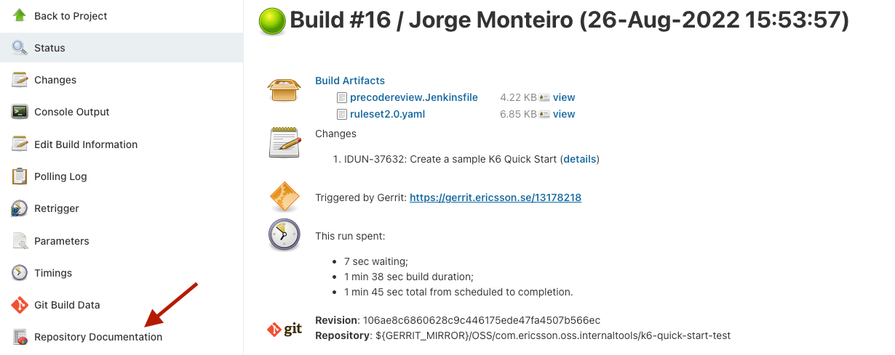

# Documentation

Is maintained in the file gradle/modules/documentation.gradle. 

This module contains the implementation of tasks to produce and publish this documentation.

This documentation is used as both a sample and a developer guide. It is expected that each staging repository produces documentation for their tests
including at least:

* How to run the tests
* What are the pre-requisites if any
* Contributions guidelines
* Ownership (the team/teams responsible)
* Supported environment variables, their types, and roles. The same for any customization like a chart values.yaml.

## Tools

To generate the documentation we use a python tool called [MkDocs](https://www.mkdocs.org/).

To avoid the need to have python or the required dependencies installed locally, a Dockerfile was created to support this 
documentation generation and the respective tasks were added to the build.

## Source Code

The documentation source code can be found at src/documentation. 
Refer to [MkDocs](https://www.mkdocs.org/) for instructions on the configuration or 
[this guide](https://www.markdownguide.org/basic-syntax/) for the Markdown syntax.

## How to generate the documentation

The whole procedure can be triggered by the **buildDocumentation** task.

```shell
./gradlew buildDocumentation
```

This will:

* filter the documentation source code to replace any variables (e.g. version)
* build a docker image with python and all required dependencies to build the documentation
* run a container based on the image produced in the previous step.
* collect the HTML produced by the container and save at **build/generated_docs**

## How to review documentation changes

Markdown is a syntax which is very easy to read, so we can easily validate the documentation as source code in gerrit.

We also publish a sample of the generated documentation at the Rre Code Review job.




## How to publish / share the documentation

Each time you merge the source code, a release job will produce the documentation and upload to:

* [Application Staging Tests](https://arm1s11-eiffel004.eiffel.gic.ericsson.se:8443/nexus/content/sites/oss-sites/application-engineering/)
* [Product Staging Tests](https://arm1s11-eiffel004.eiffel.gic.ericsson.se:8443/nexus/content/sites/oss-sites/application-engineering/)

Under one of these roots, there should be a folder for each testware and inside this folder all published versions.