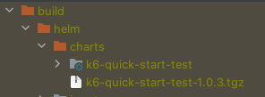

# Package the Testware

The package module (gradle/modules/package.gradle) is responsible to produce a versioned docker image and helm chart to 
deploy your testware in the target environment.

## How to create the packages

```shell
./gradlew package
```

This will produce both the docker image and the helm chart. If you want to produce just one of then:

```shell
# Produces the docker image
./gradlew buildDockerImage

# produces the Helm chart
./gradlew helmPackage
```

## Docker image source

The docker image source can be found at deployment/docker/Dockerfile.

You can update this Dockerfile to include any resources required for your tests.

**Important Note:** The container will be built with the repository root as the context, so make sure to use this path 
as reference when updating your Dockerfile

```dockerfile
FROM armdocker.rnd.ericsson.se/proj-eric-oss-dev-test/k6-base-image:latest

# Note that src is located at the root of the project, not at the same folder as the Dockerfile
ADD src/js/ /tests
ADD src/resources/ /resources
```

## Helm Chart Source

The helm chart source can be found at deployment/chart/<your-chart-name>

### Filtering

The build supports filtering on your chart source code. This means you can pass build variables to your chart (e.g. the version being published)

By default we support filtering only at the Chart.yaml and values.yaml files. Enabling it on other files can cause syntax clashing.


```groovy
helm {
    filtering {
        filePatterns = ["values.yaml", "Chart.yaml"]
        values = [
            name            : rootProject.name,
            defaultDockerTag: defaultDockerTag,
            version         : getReleaseVersion()
        ]
    }
}
```

To add additional variables you can update the map in the values property.

Once the variable is mapped, you can use it in your chart files.

```yaml
replicaCount: 1

images:
  testwareImage: ${defaultDockerTag}

build:
  version: ${version}
  name: ${name}
```

After filtering the chart will be copied to the build/helm/charts/<your chart name> folder with the values replaced

```yaml
replicaCount: 1

images:
  testwareImage: armdocker.rnd.ericsson.se/proj-eric-oss-dev-test/k6-quick-start-test:1.0.3

build:
  version: 1.0.3
  name: k6-quick-start-test
```

### Packaged Chart

After running the package task, the final chart will be produced at build/helm/charts



### Template Chart

This repository provides a template chart which can be used as a sample for other staging tests.

#### Values.yaml

The values.yaml file provided in this sample contains the minimum propeties required to deploy your testware.

Each testware might have additional needs, so feel free to update accordingly.

```yaml
replicaCount: 1

images:
  testwareImage: ${defaultDockerTag}

build:
  version: ${version}
  name: ${name}

env:
  APP_VERSION: ""
  BUILD_URL: ""
  STAGING_TYPE: "APPLICATION"
  PRODUCT: ""
  PRODUCT_VERSION: ""
  ENVIRONMENT: "development"
```

As mentioned in a previous topic, our build supports the use of gradle build variables. We can use then to 
dinamically update our chart at each build. 

E.g. update the version

To allow flexibility on your run, you need to provide a few environment variables which are consumed by the K6 base 
image to enrich the report metadata.

* **APP_VERSION**: This should match the version of the application under test in the target environment. 
* **BUILD_URL**: This should match the Jenkins job URL (including build) that triggered the test run. This information will be saved to the database for traceability.
* **STAGING_TYPE**: This should have the values APPLICATION, PRODUCT or RELEASE matching the target test environment. 
  * In most cases this information is fixed , but some tests can be re-triggered on a different target environment. E.g. product staging tests repo si also used in RELEASE.
* **PRODUCT**: The product name under test. This should match the integration chart used in the environment (e.g. EIAP)
* **PRODUCT_VERSION**: The product version deployed in the target cluster
* **ENVIRONMENT**: This variable defines the type of deployment you are using. The valid values are **production** and **development**
  * This information is internally used by the K6 base image to use the correct database and report tool version
  * When running your tests locally use the value **development** (default value if not provided)
  * When running the tests in the E2E pipeline, use the value **production**.
  * More about environments [here](../guides/environments.html).

> These values should be set on the E2E pipeline when deploying the testware

Other variables are defined inside your Dockerfile

* **TESTWARE_VERSION**: The testware version. This is automatically set to the same version on which the image was build. 
* **APP_NAME**: The application under target name. It's applicable for application staging tests only and it's immutable. The target application doesn't change.

#### Additional K6 arguments

If you need any additional K6 argument not supported by any of these variables, you can add extra arguments with the variable ADDITIONAL_ARGS

Example:
> ADDITIONAL_ARGS: --http-debug=full --verbose

These arguments will be appended to the K6 command line.

> **IMPORTANT**: Do not override the image command line. 
> 
> The K6 base image adds additional arguments which are required for the reports to work. 
> 
> If you need something unsupported by the base image, contact EPT team for support.

> **IMPORTANT**: Do not provide tags trough options files.
>
> When we include tags on the command line (which is required for the pipeline), all tags defined in the options file are ignored
>
> If you need additional tags, use the variable ADDITIONAL_ARGS = " --tag myTag=value".